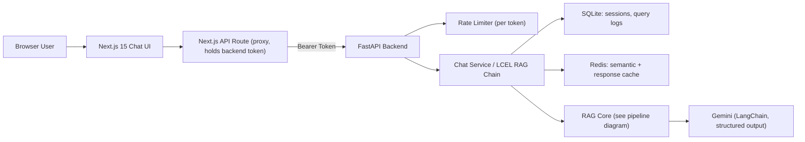
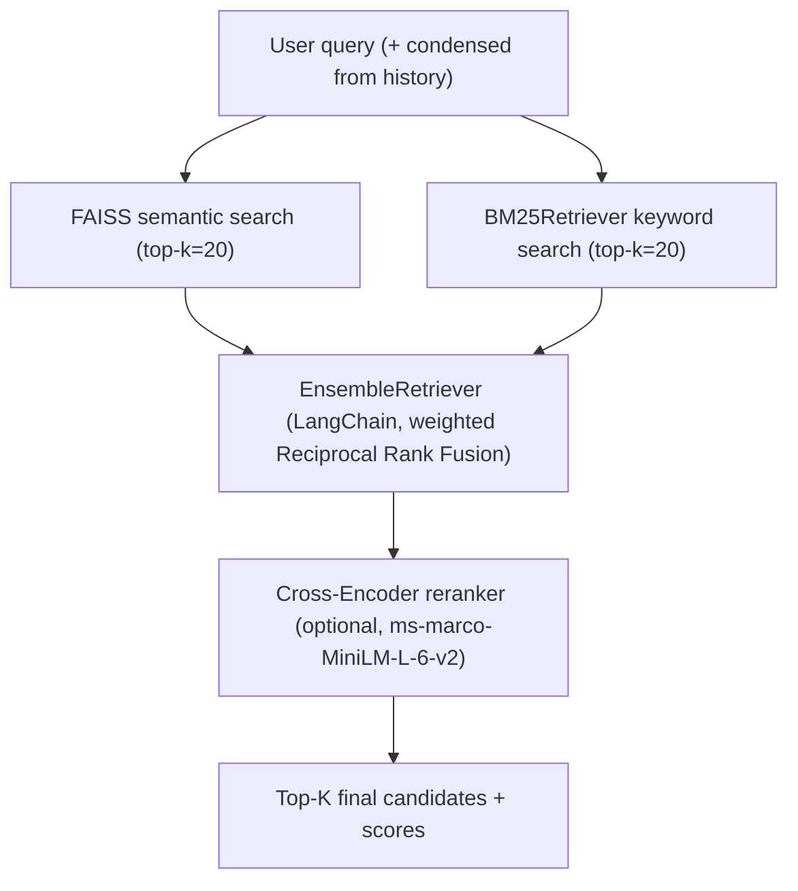

# AI Legal Assistant — Architecture Plan (MVP scope, Gemini LLM, sourced legal corpus)

Decisions locked in from clarifying questions: **LLM = Google Gemini** (via `langchain-google-genai`), **legal corpus must be sourced** from public sources (no existing data), **scope = MVP** (functional end-to-end, simplified auth/deployment, not full production hardening).

## 1. Legal Domain List (final, 6 domains + fallback)

| # | Domain | Primary source act(s) to ingest first |
|---|---|---|
| 1 | Criminal | Indian Penal Code, 1860 + Code of Criminal Procedure, 1973 |
| 2 | Civil | Code of Civil Procedure, 1908 |
| 3 | Family | Hindu Marriage Act, 1955 + Special Marriage Act, 1954 |
| 4 | Labour | Industrial Disputes Act, 1947 + Code on Wages, 2019 |
| 5 | Consumer Protection | Consumer Protection Act, 2019 |
| 6 | Property | Transfer of Property Act, 1882 |
| — | `other` (fallback classification, not a source domain) | used when query/answer doesn't map cleanly to the above — triggers cautious/refusal behavior |

Source: [India Code portal](https://indiacode.nic.in) (official bare acts). Because the portal is JS-heavy and not reliably scrapable, the plan uses a **semi-manual curation workflow**: download official PDF/HTML per act, convert to clean text (pdfplumber), then run through a section-aware parser. This is documented as a repeatable script + fallback manual step, not a fragile live scraper. Corpus starts with 1-2 acts/domain (~8 acts) and is designed to expand later.

## 2. High-Level Architecture



## 3. Data Ingestion & Indexing

- **Chunking**: custom regex-based parser (`backend/scripts/ingest.py`) that splits each act by `Section N.` boundaries (not fixed token windows), keeping chapter/section hierarchy. Each chunk = one section (further split on sub-clauses `(1)`, `(2)` if the section is very long).
- **Metadata per chunk**: `domain`, `act_name`, `act_year`, `chapter`, `section_number`, `section_title`, `source_citation` (e.g. "IPC 1860, S.304A"), `raw_text`.
- **Embeddings**: HuggingFace `BAAI/bge-base-en-v1.5` (via `langchain_huggingface.HuggingFaceEmbeddings`, CPU-friendly, strong general-purpose retrieval quality) — swappable via config.
- **Vector store**: single FAISS index (`langchain_community.vectorstores.FAISS`) covering all domains, with `domain` stored in metadata so retrieval can apply a metadata `filter` when a domain is known/pre-classified. Index persisted to `backend/data/faiss_index/` and mounted as a Docker volume.
- Ingestion is an **offline CLI script**, not an API endpoint (safer for MVP — avoids exposing index rebuild over HTTP).

## 4. Hybrid Retrieval Pipeline



- Semantic leg: FAISS `as_retriever()`.
- Keyword leg: `BM25Retriever` (rank_bm25-backed, from `langchain_community.retrievers`) built over the same chunk corpus — captures exact section numbers/terms embeddings miss.
- Fusion: LangChain's built-in `EnsembleRetriever`, which natively implements weighted Reciprocal Rank Fusion — avoids hand-rolling RRF.
- Re-ranking (optional, config flag `ENABLE_RERANKER`): `ContextualCompressionRetriever` + `CrossEncoderReranker` (HuggingFace cross-encoder) on the fused top-K before final selection.

## 5. RAG Orchestration (LangChain, LCEL)

- **Multi-turn context**: a "condense question" LLM step rewrites follow-ups into standalone queries using session history (session state kept in SQLite, keyed by `session_id`).
- **Demographic-aware prompting**: `user_type` (`layperson` | `law_student` | `lawyer`) selects a prompt-template variant controlling explanation depth/tone; system prompt always includes the legal-disclaimer instruction.
- **Generation**: `ChatGoogleGenerativeAI(model="gemini-2.5-flash"/"pro")` (config-selectable) via `.with_structured_output(schema, method="json_schema")` — Gemini's native JSON-schema-constrained decoding (confirmed current LangChain support), avoiding "return JSON as text" prompting.
- **Retry-with-repair**: wrap the structured call in a bounded retry loop (max 2 retries): on Pydantic `ValidationError` (e.g. custom validators fail), re-invoke with the validation error message appended to the prompt, rather than failing the request outright.

## 6. Structured Output Contracts (Pydantic v2)

Two-schema separation — the LLM is only asked to produce what it can honestly know; the trust-critical numeric confidence score is computed server-side, not self-reported:

```python
class LegalDomain(str, Enum):
    CRIMINAL = "criminal"; CIVIL = "civil"; FAMILY = "family"
    LABOUR = "labour"; CONSUMER = "consumer"; PROPERTY = "property"; OTHER = "other"

class LLMStructuredAnswer(BaseModel):   # what Gemini must return
    answer: str
    legal_domain: LegalDomain
    used_citation_ids: list[str]   # ids referencing retrieved chunks actually relied on
    is_refusal: bool               # LLM's own signal that context was insufficient

class SourceCitation(BaseModel):       # assembled server-side from retrieved chunks
    document: str; act_year: int | None; section: str
    domain: LegalDomain; excerpt: str; retrieval_score: float

class LegalAnswerResponse(BaseModel):  # final API contract
    answer: str
    confidence_score: float = Field(ge=0, le=1)   # computed, not LLM-reported
    legal_domain: LegalDomain
    citations: list[SourceCitation]
    is_refusal: bool
    disclaimer: str
```

## 7. Explainability & Confidence Scoring

- **Citations**: every `SourceCitation` traces back to `document + section` metadata captured at ingestion — never invented.
- **Confidence formula** (explicit, inspectable): `confidence = w1 * retrieval_component + w2 * groundedness_component`
  - `retrieval_component`: normalized fused rank/similarity score of the citations the LLM actually used.
  - `groundedness_component`: semantic-similarity overlap between generated answer sentences and their cited excerpts (embedding cosine similarity) — a cheap automated "did the answer actually come from the source" check.
- **Refusal/fallback logic**:
  - Pre-generation: if best fused retrieval score is below a threshold, skip the LLM call entirely and return a canned refusal ("insufficient information — consult a licensed lawyer").
  - Post-generation: if computed `confidence_score` falls below threshold, override with the refusal template even if the LLM produced an answer (still show whatever sources were found, marked low-confidence, for transparency).

## 8. Backend API (FastAPI)

- `POST /api/v1/chat` — `{query, session_id, user_type, consent_to_log}` → `LegalAnswerResponse`.
- `GET /api/v1/sessions/{id}/history`, `GET /api/v1/domains`, `GET /api/v1/health`.
- **Auth**: static bearer API keys (env-configured, mapped to a token→rate-limit-tier table) via a FastAPI dependency — appropriate for MVP scope vs. full user-management system.
- **Rate limiting**: `slowapi` keyed by bearer token, backed by Redis.
- **Async**: native `ainvoke` for Gemini calls; FAISS/BM25 (CPU-bound sync calls) wrapped via `asyncio.to_thread`.
- **Session/log storage**: SQLite (`sessions`, `messages`, `query_logs` tables) — sufficient for MVP, avoids standing up Postgres.

## 9. Caching

- **Semantic query cache**: small auxiliary FAISS-like similarity check against recent query embeddings; a near-duplicate (cosine > 0.95) short-circuits to a cached `LegalAnswerResponse`.
- **Response cache**: Redis, keyed by `hash(normalized_query + user_type)`, with TTL — cuts cost/latency for repeated questions.

## 10. Logging & Privacy

- JSONL/SQLite `query_logs`: timestamp, hashed token id, query (only stored in full if `consent_to_log=true`, else only a hash is kept), retrieved chunk ids, confidence score, latency, model used.

## 11. Evaluation Set

- `backend/eval/qa_dataset.jsonl`: 30-50 hand-written Q&A pairs spanning all 6 domains with expected domain + expected section references.
- `backend/eval/run_eval.py`: offline CLI computing retrieval precision/recall@k against expected sections, plus basic answer-correctness scoring — run manually, not part of the live API.

## 12. Frontend (Next.js 15, App Router)

- Chat UI (`app/page.tsx`) with message bubbles, per-answer citation cards (document/section/excerpt), a color-coded confidence badge, a persistent disclaimer banner, and a `user_type` selector.
- A consent checkbox ("I consent to logging for quality/audit") gates the `consent_to_log` flag.
- `app/api/chat/route.ts` proxies to the FastAPI backend server-side — the backend bearer token lives only in the Next.js server environment, never sent to the browser.

## 13. Deployment

- `docker-compose.yml` services: `backend` (FastAPI, FAISS volume-mounted), `frontend` (Next.js standalone), `redis` (cache/rate-limit). Ingestion is run once via `docker compose run backend python scripts/ingest.py` (or locally) before the backend starts serving.

## 14. Proposed Repository Structure

```
AI Legal Assistant/
  backend/
    app/{api,core,rag,schemas,services}/...
    scripts/ingest.py, download_sources.py
    data/{raw,processed,faiss_index}/<domain>/...
    eval/qa_dataset.jsonl, run_eval.py
    tests/
    Dockerfile, requirements.txt
  frontend/
    app/page.tsx, app/api/chat/route.ts
    components/{ChatWindow, CitationCard, ConfidenceBadge, DisclaimerBanner}
    Dockerfile
  docker-compose.yml
  .env.example
  README.md
```

## Implementation Phases (for later execution — no code written yet)

1. Data sourcing + section-aware ingestion pipeline + FAISS/BM25 index build.
2. Backend RAG core: hybrid retrieval, LCEL chain, Gemini structured output + retry-repair, confidence scorer, refusal logic.
3. FastAPI layer: auth, rate limiting, session/history, caching, logging.
4. Next.js frontend: chat UI, proxy route, citations/confidence display, disclaimers/consent.
5. Dockerization + docker-compose wiring.
6. Evaluation set + run_eval script.
