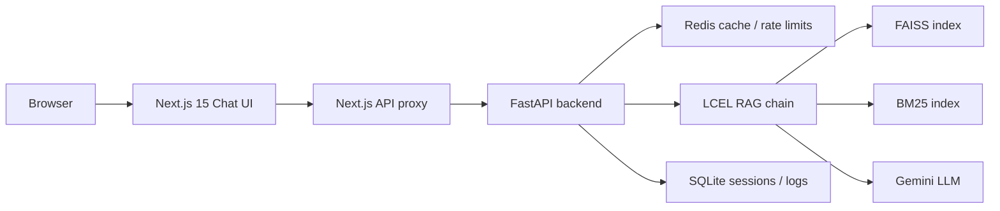

# AI Legal Assistant

An explainability-first, citation-grounded RAG assistant for Indian law. Every answer is grounded in retrieved statutory text, cites its exact source (act + section), and carries a **computed** confidence score — never a self-reported LLM guess.

> **Deeper context:** [PRD.md](./PRD.md) (what/why) · [PLAN.md](./PLAN.md) (architecture) · [TASKS.md](./TASKS.md) (implementation breakdown) · [STRUCTURE.md](./STRUCTURE.md) (repo layout)

## What it does

- Answers natural-language questions across six legal domains: criminal, civil, family, labour, consumer, and property.
- Retrieves relevant statutory sections via a hybrid **FAISS + BM25** pipeline, then generates a structured answer with **Gemini**.
- Returns citations, a confidence score, and a legal disclaimer on every response.
- Refuses to answer when retrieval or confidence is too low (see [PLAN.md](./PLAN.md) Section 7).

This is **not** legal advice and does **not** draft binding legal documents.

## Architecture at a glance

The system has three runtime services (backend, frontend, Redis) plus offline index build:



Retrieval, RAG orchestration, API contracts, and deployment details are documented with additional diagrams in [PLAN.md](./PLAN.md) (Sections 2–5, 8, 13).

## Prerequisites

| Tool | Version | Used for |
|---|---|---|
| **Python** | 3.12+ | Backend API, ingestion, index build, eval |
| **Node.js** | 20+ | Frontend dev server / build |
| **Docker Desktop** | recent | Recommended: full stack + Redis (WSL 2 on Windows) |
| **Gemini API key** | — | LLM generation ([get one below](#gemini-api-key)) |

Raw act texts are already checked in under `backend/data/raw/`. You do **not** need to run corpus curation scripts for a first-time setup.

---

## Environment variables

Copy the example file at the **repo root**:

```bash
cp .env.example .env
```

Edit `.env` before starting any service. The tables below list what you must set; the full annotated list lives in [`.env.example`](./.env.example).

### Required for chat (local or Docker)

| Variable | Example | Purpose |
|---|---|---|
| `GOOGLE_API_KEY` | `AIza…` | Gemini API key for answer generation |
| `BACKEND_API_TOKENS` | `changeme-dev-token:standard` | Bearer token(s) the backend accepts (`token:tier` pairs) |
| `BACKEND_API_TOKEN` | `changeme-dev-token` | Token the **frontend proxy** sends — must match a token in `BACKEND_API_TOKENS` |

### Required for local development (no Docker)

| Variable | Local value | Notes |
|---|---|---|
| `REDIS_URL` | `redis://localhost:6379/0` | Start Redis first (see [Local development](#local-development-without-docker)) |
| `BACKEND_API_URL` | `http://127.0.0.1:8000` | Used by the Next.js server-side proxy |

For **Docker Compose**, keep the compose defaults already in `.env.example`:

- `REDIS_URL=redis://redis:6379/0`
- `BACKEND_API_URL=http://backend:8000`

Compose overrides these at runtime where needed; see [`docker-compose.yml`](./docker-compose.yml).

### Optional tuning

Embedding model, retrieval `top_k`, confidence thresholds, cache TTL, and rate-limit tiers are all configurable — see `.env.example`. Defaults match [PLAN.md](./PLAN.md).

### Gemini API key

1. Open [Google AI Studio](https://aistudio.google.com/apikey).
2. Sign in with a Google account.
3. Click **Create API key** and copy the value into `GOOGLE_API_KEY` in your `.env`.

The backend validates this key at startup (`app/core/config.py`) and refuses to boot if it is missing or blank.

### Frontend-only env (local dev)

When running the frontend outside Docker, also create `frontend/.env.local`:

```bash
cp frontend/.env.example frontend/.env.local
```

Set `BACKEND_API_URL=http://127.0.0.1:8000` and the same `BACKEND_API_TOKEN` as in your root `.env`.

---

## Quick start with Docker Compose (recommended)

This path brings up **backend + frontend + Redis** and is the fastest way to demo the full system.

### 1. Configure environment

```bash
cp .env.example .env
# Edit .env: set GOOGLE_API_KEY; keep BACKEND_API_TOKEN in sync with BACKEND_API_TOKENS
```

### 2. Build the search indices (one-time)

Populates named Docker volumes (`faiss_index`, `sqlite_data`) with processed chunks and retrieval indices. The first run downloads the HuggingFace embedding model — allow several minutes.

```bash
docker compose run --rm backend python scripts/ingest.py
docker compose run --rm backend python scripts/build_index.py
```

### 3. Start all services

```bash
docker compose up --build
```

| URL | Service |
|---|---|
| http://localhost:3000 | Chat UI |
| http://localhost:8000/api/v1/health | Backend health check |

### 4. Send a chat message

Open http://localhost:3000, accept the disclaimer, and ask a question such as:

> What is the punishment for theft under the Indian Penal Code?

You should receive an answer with citations and a confidence badge.

### 5. Stop / restart

```bash
docker compose down      # containers stop; named volumes persist
docker compose up        # indices and Redis data are still there
```

Named volumes: `redis_data`, `faiss_index`, `sqlite_data`.

---

## Local development (without Docker)

Use this when iterating on backend or frontend code. You still need Redis and built indices for full chat functionality.

### 1. Environment

```bash
cp .env.example .env
# Edit .env:
#   GOOGLE_API_KEY=...
#   REDIS_URL=redis://localhost:6379/0
#   BACKEND_API_TOKENS=changeme-dev-token:standard
#   BACKEND_API_TOKEN=changeme-dev-token
```

```bash
cp frontend/.env.example frontend/.env.local
```

### 2. Start Redis

Easiest option — Redis only via Compose:

```bash
docker compose up redis -d
```

Or run a local Redis instance on port 6379.

### 3. Backend

```bash
cd backend
python -m venv .venv

# Windows
.venv\Scripts\activate
# macOS / Linux
source .venv/bin/activate

pip install -r requirements.txt
cp ../.env .env          # backend reads .env from its working directory

python scripts/ingest.py
python scripts/build_index.py

uvicorn app.main:app --reload --host 127.0.0.1 --port 8000
```

Verify: http://127.0.0.1:8000/api/v1/health → `{"status":"ok"}`

### 4. Frontend

In a second terminal:

```bash
cd frontend
npm install
npm run dev
```

Open http://localhost:3000 and send a chat message.

---

## Corpus ingestion and index build

Raw act texts live in `backend/data/raw/<domain>/`. The offline pipeline (from `backend/` with your virtualenv active):

```bash
# 1. Parse raw acts into processed JSONL chunks
python scripts/ingest.py

# 2. QA pass — exits non-zero on corpus issues
python scripts/validate_corpus.py

# 3. Validate + build FAISS and BM25 indices
python scripts/build_index.py
```

Step 3 aborts without writing indices if validation fails. On success it writes:

- `data/faiss_index/` — semantic FAISS index
- `data/bm25_index/` — keyword BM25 index

The first FAISS build downloads `EMBEDDING_MODEL` (default `BAAI/bge-base-en-v1.5`). Paths are configurable via `FAISS_INDEX_DIR` and `BM25_INDEX_DIR` in `.env`.

**Maintainers only:** to regenerate raw corpus files from upstream sources, run the `backend/scripts/curate_*.py` scripts for each domain and their matching `pytest tests/test_corpus_*.py` checks.

---

## Evaluation

`backend/eval/qa_dataset.jsonl` contains hand-written questions across all six domains with expected sections. After indices are built:

```bash
cd backend

# Retrieval-only — no LLM calls
python eval/run_eval.py

# Full RAG chain scoring — makes real Gemini API calls
python eval/run_eval.py --with-answers --user-type lawyer
```

Reports are written to `backend/eval/results/`:

- `retrieval_report.json` — machine-readable metrics
- `eval_report.md` — human-readable summary with flagged questions
- `eval_report.csv` — per-question spreadsheet

---

## Testing

### Backend

From `backend/` with the virtualenv activated:

```bash
pytest -q
```

Tests use safe defaults from `tests/conftest.py` — no real Gemini calls, network, or Redis required for the suite.

### Frontend

From `frontend/`:

```bash
npm test
```

---

## Project layout

See [STRUCTURE.md](./STRUCTURE.md) for the full annotated directory tree. Key paths:

```
backend/
  app/              FastAPI app, RAG chain, API routes
  data/raw/         Curated act texts (checked in)
  data/faiss_index/ Built semantic index (gitignored)
  data/bm25_index/  Built keyword index (gitignored)
  scripts/          Ingestion and index-build CLIs
  eval/             Evaluation dataset and run_eval.py
frontend/
  app/              Next.js App Router pages and API proxy routes
  components/       Chat UI, citations, disclaimer
docker-compose.yml  Backend + frontend + Redis
.env.example        All environment variables (copy to .env)
```

---

## Troubleshooting

| Symptom | Likely fix |
|---|---|
| Backend won't start: `GOOGLE_API_KEY must not be blank` | Set a real key in `backend/.env` (local) or root `.env` (Docker) |
| Chat returns 503 "Backend proxy is not configured" | Set `BACKEND_API_URL` and `BACKEND_API_TOKEN` in `frontend/.env.local` |
| Chat returns 401 from backend | `BACKEND_API_TOKEN` must match a token in `BACKEND_API_TOKENS` |
| Refusal on every question | Indices not built — run `scripts/build_index.py` or the compose one-liners above |
| Rate-limit / cache errors locally | Start Redis (`docker compose up redis -d`) and set `REDIS_URL=redis://localhost:6379/0` |
| `docker` not found in WSL | Start Docker Desktop on Windows; enable WSL integration in Docker Desktop settings |
| First index build is slow | Normal — HuggingFace embedding model download on first `build_index.py` run |
